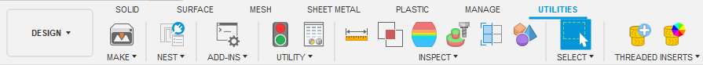
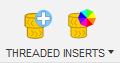
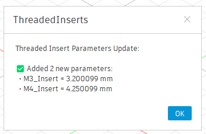
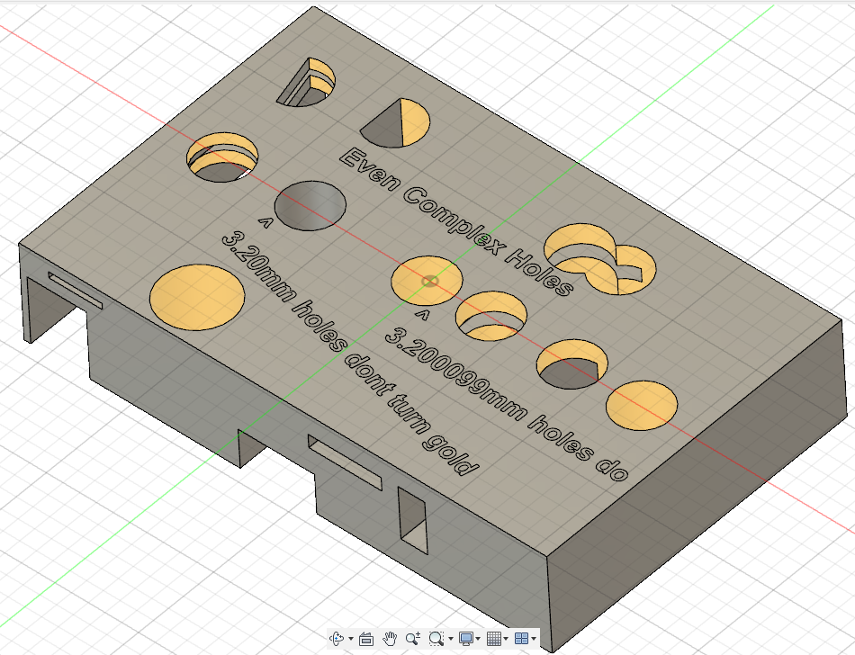

# Threaded Insert Add-in for Fusion 360

A vibe coded Autodesk Fusion / Fusion360 add-in for managing threaded insert workflows. This tool helps teams identify and mark threaded insert holes using unique diameter parameters and applying a visual appearance.



https://github.com/user-attachments/assets/337ea7f5-0e4b-4b56-ae30-c88b549de58b

## Overview

This add-in provides two main functions:
1. **Add Insert Parameters** - Adds user parameters for your commonly used Heat Set Threaded Insert diameters

   
   
2. **Apply Insert Appearance** - Applies "Brass - Matte" appearance to the inner edge of threaded insert holes for visual identification

    


## Installation

1. Copy the `ThreadedInserts` folder into your Fusion 360 add-ins directory:
   - **Windows**: `%appdata%\Autodesk\Autodesk Fusion 360\API\AddIns\`
   - **Mac**: `~/Library/Application Support/Autodesk/Autodesk Fusion 360/API/AddIns/`
2. In Fusion, go to **Utilities > Scripts and Add-Ins**
3. Find "ThreadedInsert" and click **"Run"**
4. Check **"Run on Startup"** to load automatically

This adds a custom panel to your configured location:



## Configuring the Add In

Configuration changes are applied directly to the add in's main script by opening `ThreadedInserts/ThreadedInserts.py` in a text editor. The two most common changes have been moved to the top of the file for ease:
```
# --------- CONFIGURATION ----------------------------------------------------
# Configuration: Choose which tab to place the Threaded Inserts panel
# Uncomment ONE of the following lines, do not leave any leading spaces/indents:

#TARGET_TAB_ID = 'SolidTab'      # Places panel in SOLID tab (main design commands)
TARGET_TAB_ID = 'ToolsTab'    # Places panel in UTILITIES tab (workflow tools)


# Define your threaded insert configurations (name, diameter_mm, description):

THREADED_INSERT_CONFIGS = [
    ('M3_Insert', 3.200099, 'M3 threaded insert diameter'),
    ('M4_Insert', 4.250099, 'M4 threaded insert diameter'),
    # Add more insert sizes as needed: ('Parameter_Name', diameter_in_mm, 'Description')
]

# --------- END ----------------------------------------------------
```
### Choosing Where The Add In's Panel Is Created

As the comments say, uncomment (remove the "#" character) one of the two lines. Dont leave any indentation before the line (eg a tab or a space) because python.

### Adding/Changing The Defined Threaded Insert Diameters

You can add/remove/edit definitions in this list, as long as they follow the format of `(<Parameter_Name>, <diameter_in_mm>, <Description>)`. I recommend using diameters which end in `x.xx0099` because you will never accidentally use that as a normal dimension

Note: dont end your dimensions in `x.xx0001`, eg ("3.200001"), this puts the dimension too close to a real dimension (eg "3.20") and the script will start messing with those dimensions too

## Usage Workflow

### Step 1: Setup Design File
1. Open your design file in Fusion
2. Click **"Add Insert Parameters"** button in the Threaded Inserts panel
    - The add-in then creates a user parameter for each of your threaded insert diameters:
    - `M3_Insert = 3.200099 mm`
    - `M4_Insert = 4.250099 mm`
    - ....

    

### Step 2: Design Your Part
1. Use the User Parameters to design your part. 
    - Whenever you want to add a feature which will have a threaded insert installed, define it's diameter using the relevant user parameter
    - The unique decimal values (e.g. `3.200099`) allow the add-in to distinguish threaded insert holes from regular holes

### Step 3: Apply Appearance Changesd to Insert Locations
1. Click **"Apply Insert Appearance"** button
2. The add-in automatically finds all holes matching threaded insert diameters
3. Applies "Brass - Matte" appearance to the inner cylindrical surfaces
4. Provides summary of how many holes were marked




## Features

- **Detection**: Finds threaded insert holes based on unique diameter parameters
- **Visual Marking**: Uses brass appearance to clearly identify insert locations
- **Complex Geometry Compatible**: hole detection works even on partial cylinders or cylinders changed by other features 
- **Multi-Size Support**: Handles multiple threaded insert sizes simultaneously
- **Adds User Parameters**: Adds user parameters for each threaded insert diamneter upon the click of a button
- **Team Consistency**: Ensures everyone uses the same unique diameter values
- **Conflict Detection**: Warns if existing parameters have different values
- **UI Integration**: Clean UI buttons with custom icons

## Troubleshooting

### No Holes Found
- Ensure you used the parameter names (e.g., `M3_Insert`) when creating holes
- Check that hole diameters exactly match the parameter values

### Appearance Not Applied
- Ensure "Brass - Matte" appearance exists in Fusion's material libraries
- Check that holes are actual cylindrical faces (not just sketch circles)
- Verify the add-in has access to material libraries

### Buttons Not Visible
- Check that you're in the correct workspace (Design)
- Look for the "Threaded Inserts" panel in the configured tab
- Ensure both buttons are pinned (should happen automatically)

## Technical Details

- **Diameter Precision**: Uses 7 decimal places for unique identification
- **Face Detection**(no, not that kind of face detection): Analyzes cylindrical faces to determine if they're internal (holes)
- **Error Handling**: Provides clear feedback on parameter conflicts and failures
